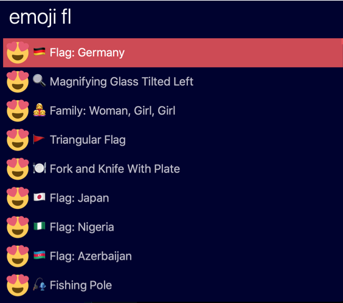

  
    

# alfred-emoji-local
Alfred emoji local is a local emoji, emoji short code and emoji hex value finder. It does not need an internet connection to look for emojis, and supports 1500+ emojis found in [emojipedia](https://emojipedia.org). The search uses fuzzy matching.

## Usage
The alfred trigger work is **emoji**. Then simply Search what you are looking for. The search supports for text, and short codes.

- Press enter to copy emoji to clipboard
- Press **cmd** + enter to copy emoji codepoint which can be used with something like `String.fromCodePoint` in JS and others
- Press **alt** + enter to copy the short code which is similar to slacks `:happy:` notation. 

## Install
Using npm: 
`npm i -g alfred-emoji-local`

Using packfile:
Double click on the release pack file.

### Requires
*Requires Node.js and Alfred 3 Powerpack*